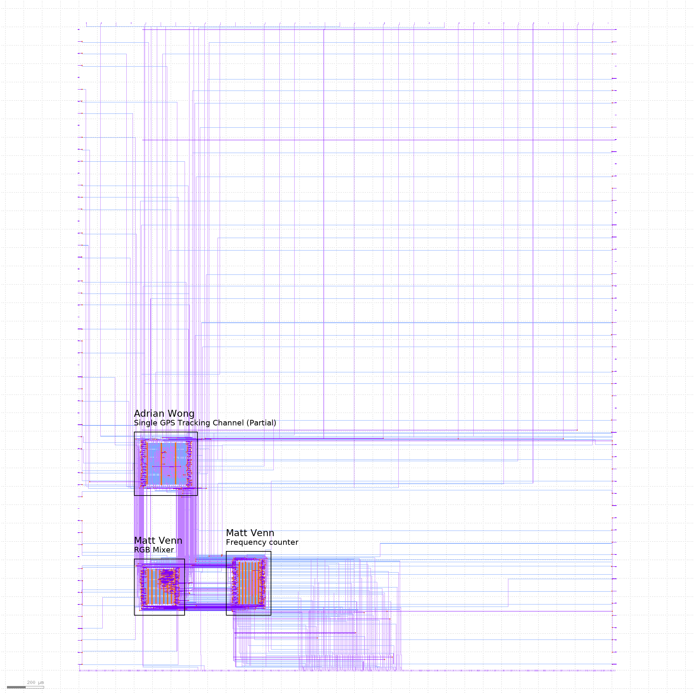
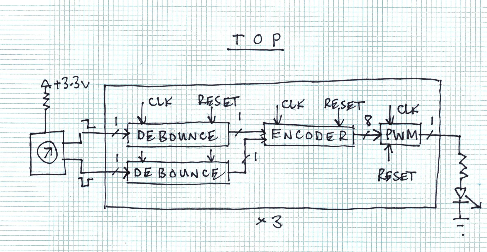
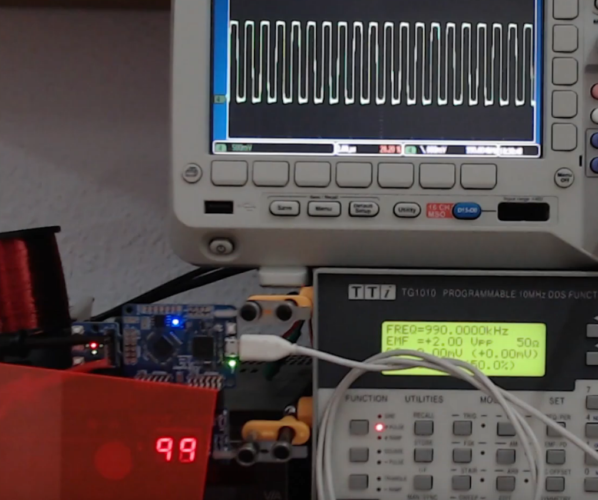
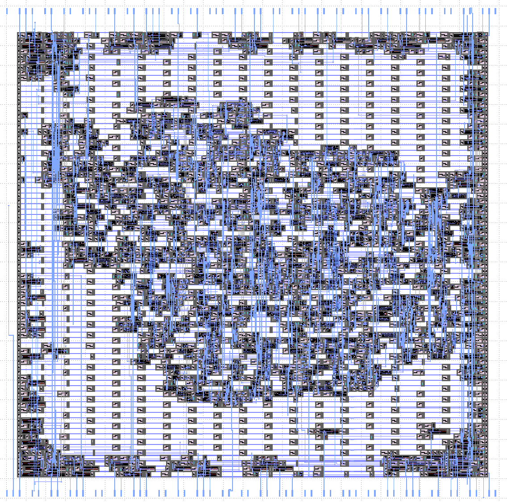

# Zero to ASIC Group submission MPW7

This ASIC was designed by members of the [Zero to ASIC course](https://zerotoasiccourse.com).

This submission was configured and built by the [multi project tools](https://github.com/mattvenn/multi_project_tools) at commit [002e6bddcfac081cc193110ebcbc2e92584d9699](https://github.com/mattvenn/multi_project_tools/commit/002e6bddcfac081cc193110ebcbc2e92584d9699).

The configuration files are [projects.yaml](projects.yaml) & [local.yaml](local.yaml). See the CI for how the build works.

    # clone all repos, and include support for shared OpenRAM
    ./multi_tool.py --clone-repos --clone-shared-repos --create-openlane-config --copy-gds --copy-project --openram

    # run all the tests
    ./multi_tool.py --test-all --force-delete

    # build user project wrapper submission
    cd $CARAVEL_ROOT; make user_project_wrapper

    # create docs
    ./multi_tool.py --generate-doc --annotate-image

# Project Index

## RGB Mixer

* Author: Matt Venn
* Github: https://github.com/mattvenn/wrapped_rgb_mixer
* commit: b7b325e6cde0e0bac8d7945f712b7786542ecfa6
* Description: reads 3 encoders and generates PWM signals to drive an RGB LED

## Frequency counter

* Author: Matt Venn
* Github: https://github.com/mattvenn/wrapped_frequency_counter
* commit: 948693c3ab8e8d6161caf55e04fc655fbd7134bf
* Description: Counts pulses on input and displays frequency on 2  seven segment displays

## Single GPS Tracking Channel (Partial)

* Author: Adrian Wong
* Github: https://github.com/mattvenn/wrapped_channel
* commit: b33b6aa4d5b40e11776a99a4db7652fc1c7299ae
* Description: Partial implementation of an L1 GPS tracking channel

