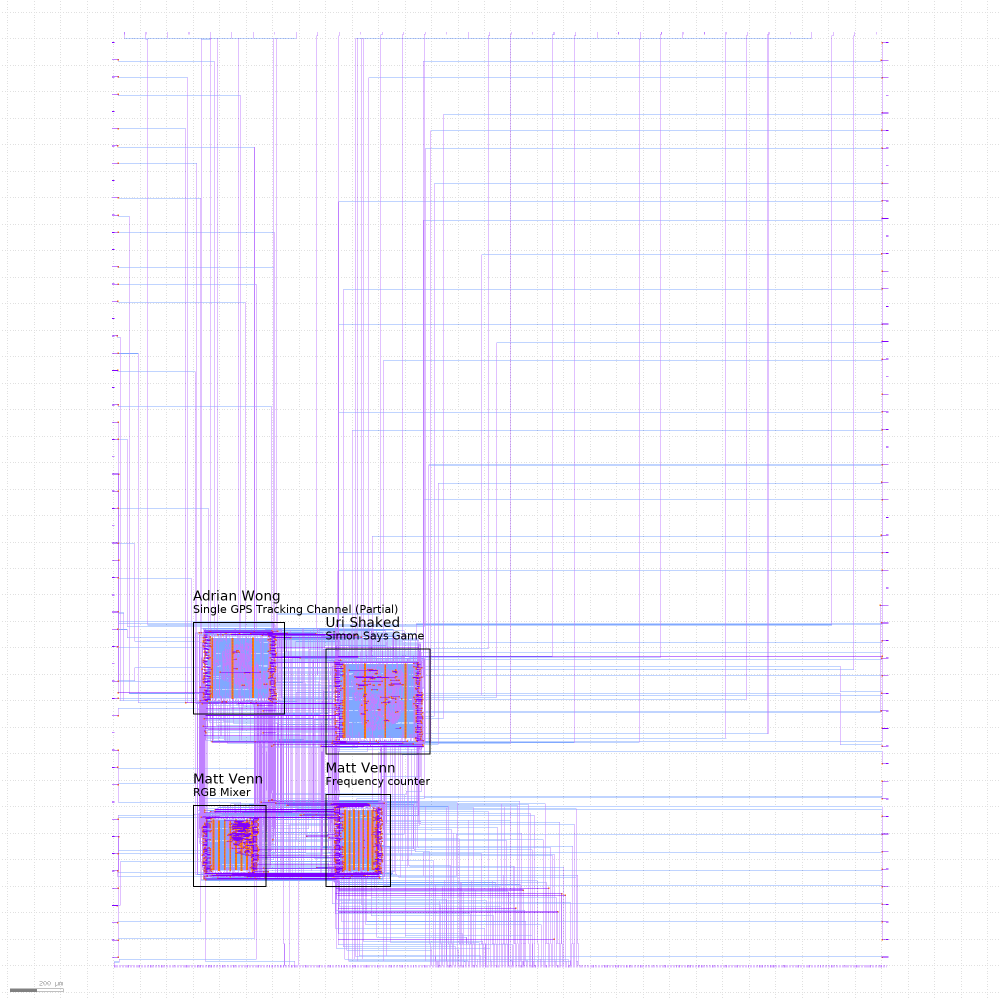

# Zero to ASIC Group submission MPW7

This ASIC was designed by members of the [Zero to ASIC course](https://zerotoasiccourse.com).

This submission was configured and built by the [multi project tools](https://github.com/mattvenn/multi_project_tools) at commit [61ad60a8c8c5585d3c32dfb4281a904153df936a](https://github.com/mattvenn/multi_project_tools/commit/61ad60a8c8c5585d3c32dfb4281a904153df936a).

The configuration files are [projects.yaml](projects.yaml) & [local.yaml](local.yaml). See the CI for how the build works.

    # clone all repos, and include support for shared OpenRAM
    ./multi_tool.py --clone-repos --clone-shared-repos --create-openlane-config --copy-gds --copy-project --openram

    # run all the tests
    ./multi_tool.py --test-all --force-delete

    # build user project wrapper submission
    cd $CARAVEL_ROOT; make user_project_wrapper

    # create docs
    ./multi_tool.py --generate-doc --annotate-image

# Project Index

## RGB Mixer

* Author: Matt Venn
* Github: https://github.com/mattvenn/wrapped_rgb_mixer
* commit: 9bacd7373de7b80870e98f5b891c68841948353e
* Description: reads 3 encoders and generates PWM signals to drive an RGB LED

## Frequency counter

* Author: Matt Venn
* Github: https://github.com/mattvenn/wrapped_frequency_counter
* commit: 7d294428b66e61cb4ac005ae1abca10ca3ea86ec
* Description: Counts pulses on input and displays frequency on 2  seven segment displays

